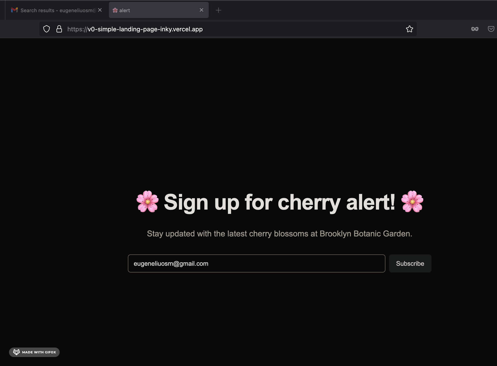
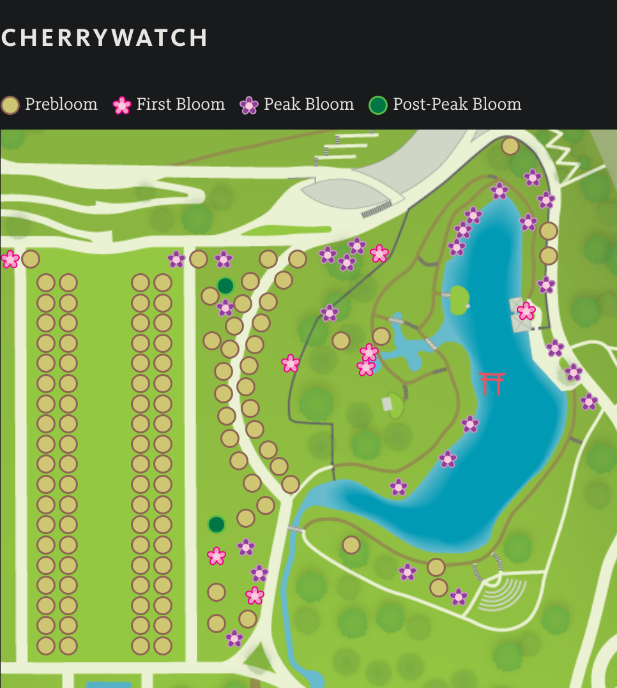
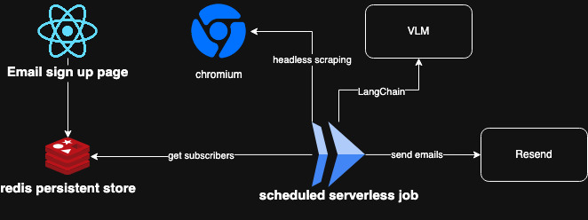

# Cherry alert 🌸

Get daily email update on how many cherry trees are blooming at the Brooklyn Botanic Garden.

## Goal
I wanted to go see cherry blossoms at the Brooklyn Botanic Garden. They do have a website with a diagram displaying blooming status, **but it's tedious to check there everyday and they don't offer any notification like emailing**.

*(image on official website, surprisingly each icon is a div img and updated with js on each day)*
## Design

* Playwright browser automation for screenshot
* Langchain to anyalyze screenshot and extract statistics with Gemini on GCP
* Redis db for storing emails and Resend for sending emails

## Misc notes 
* reduce size of image for a smaller payload (token wise)
* temperature should be lowest
